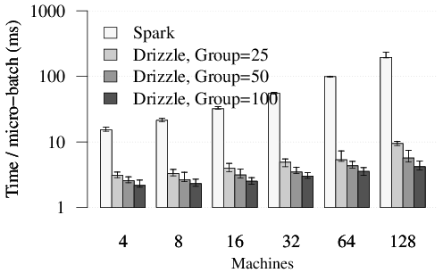

# Apache Spark

Spark is a fast and general cluster computing system for Big Data. It provides
high-level APIs in Scala, Java, Python, and R, and an optimized engine that
supports general computation graphs for data analysis. It also supports a
rich set of higher-level tools including Spark SQL for SQL and DataFrames,
MLlib for machine learning, GraphX for graph processing,
and Spark Streaming for stream processing.

<http://spark.apache.org/>


## Online Documentation

You can find the latest Spark documentation, including a programming
guide, on the [project web page](http://spark.apache.org/documentation.html).
This README file only contains basic setup instructions.

## Building Spark

Spark is built using [Apache Maven](http://maven.apache.org/).
To build Spark and its example programs, run:

    build/mvn -DskipTests clean package

(You do not need to do this if you downloaded a pre-built package.)

You can build Spark using more than one thread by using the -T option with Maven, see ["Parallel builds in Maven 3"](https://cwiki.apache.org/confluence/display/MAVEN/Parallel+builds+in+Maven+3).
More detailed documentation is available from the project site, at
["Building Spark"](http://spark.apache.org/docs/latest/building-spark.html).

For general development tips, including info on developing Spark using an IDE, see ["Useful Developer Tools"](http://spark.apache.org/developer-tools.html).

## Interactive Scala Shell

The easiest way to start using Spark is through the Scala shell:

    ./bin/spark-shell

Try the following command, which should return 1000:

    scala> sc.parallelize(1 to 1000).count()

## Interactive Python Shell

Alternatively, if you prefer Python, you can use the Python shell:

    ./bin/pyspark

And run the following command, which should also return 1000:

    >>> sc.parallelize(range(1000)).count()

## Example Programs

Spark also comes with several sample programs in the `examples` directory.
To run one of them, use `./bin/run-example <class> [params]`. For example:

    ./bin/run-example SparkPi

will run the Pi example locally.

You can set the MASTER environment variable when running examples to submit
examples to a cluster. This can be a mesos:// or spark:// URL,
"yarn" to run on YARN, and "local" to run
locally with one thread, or "local[N]" to run locally with N threads. You
can also use an abbreviated class name if the class is in the `examples`
package. For instance:

    MASTER=spark://host:7077 ./bin/run-example SparkPi

Many of the example programs print usage help if no params are given.

## Running Tests

Testing first requires [building Spark](#building-spark). Once Spark is built, tests
can be run using:

    ./dev/run-tests

Please see the guidance on how to
[run tests for a module, or individual tests](http://spark.apache.org/developer-tools.html#individual-tests).

## A Note About Hadoop Versions

Spark uses the Hadoop core library to talk to HDFS and other Hadoop-supported
storage systems. Because the protocols have changed in different versions of
Hadoop, you must build Spark against the same version that your cluster runs.

Please refer to the build documentation at
["Specifying the Hadoop Version"](http://spark.apache.org/docs/latest/building-spark.html#specifying-the-hadoop-version)
for detailed guidance on building for a particular distribution of Hadoop, including
building for particular Hive and Hive Thriftserver distributions.

## Configuration

Please refer to the [Configuration Guide](http://spark.apache.org/docs/latest/configuration.html)
in the online documentation for an overview on how to configure Spark.

## Contributing

Please review the [Contribution to Spark guide](http://spark.apache.org/contributing.html)
for information on how to get started contributing to the project.

# Drizzle: Low Latency Execution for Apache Spark

Drizzle is a low latency execution engine for Apache Spark that is targeted
at stream processing and iterative workloads. Currently, Spark uses a BSP
computation model, and notifies the scheduler at the end of each task. Invoking
the scheduler at the end of each task adds overheads and results in decreased
throughput and increased latency.

In Drizzle, we introduce group scheduling, where multiple batches (or a group) of computation
are scheduled at once. This helps decouple the granularity of task execution from scheduling and
amortize the costs of task serialization and launch.

## Drizzle Example
The current Drizzle prototype exposes a low level API using the `runJobs` method in [SparkContext](core/src/main/scala/org/apache/spark/SparkContext.scala). This method takes in a
`Seq` of RDDs and corresponding functions to execute on these RDDs. Examples of using this API can be seen in [DrizzleSingleStageExample](examples/src/main/scala/org/apache/spark/examples/DrizzleSingleStageExample.scala) and [DrizzleRunningSum](examples/src/main/scala/org/apache/spark/examples/DrizzleRunningSum.scala).

To try out Drizzle locally, we first build Spark based on existing [instructions](http://spark.apache.org/docs/latest/building-spark.html). For example, using SBT we can run
```
  ./build/sbt package
```
We can run then run the `DrizzleRunningSum` example with 4 cores for 10 iterations with group size 10. Note that this example requires at least 4GB of memory on your machine.
```
  ./bin/run-example --master "local-cluster[4,1,1024]" org.apache.spark.examples.DrizzleRunningSum 10 10
```
To compare this with existing Spark, we can run the same 10 iterations but now with a group size of 1
```
  ./bin/run-example --master "local-cluster[4,1,1024]" org.apache.spark.examples.DrizzleRunningSum 10 1
```

The benefit from using Drizzle is more apparent on large clusters. Results from running the
single stage benchmark for 100 iterations on a
[Amazon EC2 cluster](spark.apache.org/docs/latest/ec2-scripts.html) of 128 machines is shown below.

<p style="text-align: center;">
  
</p>

## Status
The source code in this repository is a research prototype and only implements the scheduling techniques described in our paper.
The existing Spark unit tests pass with our changes and we are actively working on adding more tests for Drizzle.
We are also working towards a Spark JIRA to discuss integrating Drizzle with the Apache Spark project.

Finally we would like to note that extensions to integrate Structured Streaming and Spark ML will be implemented separately.

## For more details
For more details about the architecture of Drizzle please see our
[Spark Summit 2015 Talk](https://spark-summit.org/2016/events/low-latency-execution-for-apache-spark/)
and our [Technical Report](http://shivaram.org/drafts/drizzle.pdf)

## Acknowledgements
This is joint work with Aurojit Panda, Kay Ousterhout, Mike Franklin, Ali Ghodsi, Ben Recht and Ion
Stoica from the [AMPLab](http://amplab.cs.berkeley.edu) at UC Berkeley.
